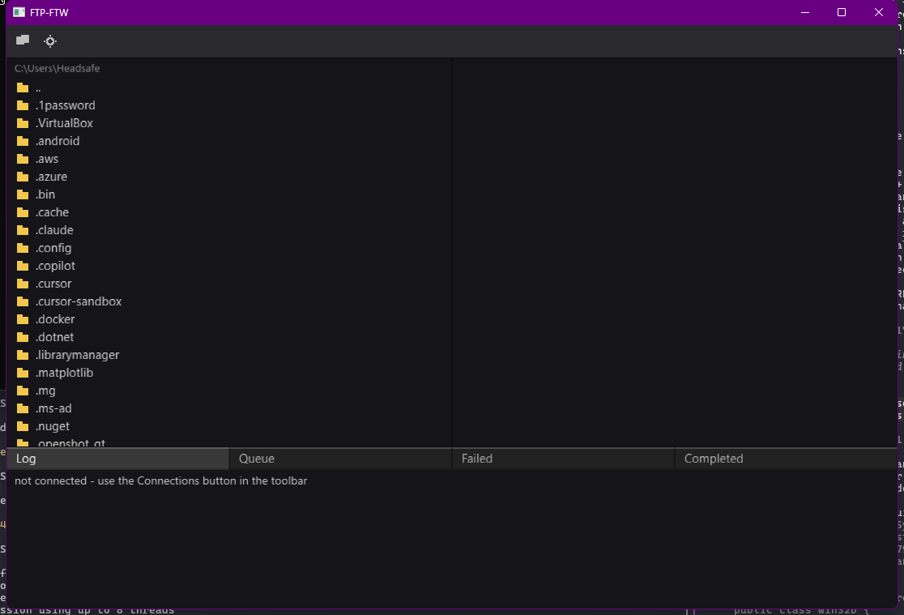

# FTP-FTW

A native, data-oriented SFTP client for Windows. No Electron, no
Chromium, no Node, no framework — just a small C codebase talking
directly to Win32, Direct3D 11, and DirectWrite, doing its own memory
management and its own threading from scratch.



## Why this exists

Most desktop file transfer clients today ship a web browser to render a
file list. FTP-FTW takes the opposite bet: that a GUI app doing real,
disk- and network-bound work should feel instant, cost almost nothing
at rest, and fit in less space than a single high-resolution photo.

That bet is directly inspired by two people:

- **[Casey Muratori](https://caseymuratori.com/)** and the broader
  handmade / data-oriented programming movement — the idea that
  software gets *simpler*, not more complex, when you design around
  your actual data and its transformations instead of reaching for
  frameworks, abstraction layers, and hidden control flow by default.
- **[Ryan Fleury](https://www.rfleury.com/)** and
  [RAD Debugger](https://github.com/EpicGames/raddebugger) — this
  project studies RAD Debugger's `base` layer as a working reference
  and deliberately mirrors its conventions rather than reinventing
  them: the arena allocator, the non-null-terminated `String8` string
  type, the `Thread`/`Mutex`/`CondVar` primitives, the
  `GuardedRing` cross-thread message-passing pattern, and the
  short-prefix-per-layer namespacing scheme. RAD Debugger is vendored
  as a read-only git submodule purely so those conventions stay one
  `git grep` away, not because FTP-FTW links against it.

None of this is a purity exercise. It's what "joy to use" cashes out
to for a file transfer client: instant directory listings, transfers
that never block the UI thread, and a window that opens before you've
finished moving your hand off the taskbar.

## It's small. Really small.

The release build's entire `.exe` — the whole app: SSH/SFTP client,
Direct3D 11 renderer, DirectWrite text shaping and glyph atlas cache,
a hand-rolled immediate-mode GUI, the transfer engine, everything — is:

```
382 KB
```

That's one file, no installer, no bundled runtime. `dumpbin
/dependents` on the release binary shows exactly eight DLLs, and every
one of them already ships with Windows:

```
KERNEL32.dll   USER32.dll     WS2_32.dll      CRYPT32.dll
bcrypt.dll     d3d11.dll      DWrite.dll      D3DCOMPILER_47.dll
```

No Visual C++ runtime redistributable, no .NET, no WebView2, no
Chromium. Copy the `.exe` to a machine and it runs.

For scale: a typical Electron-based desktop app ships an entire
Chromium browser and V8 runtime before it draws a single pixel of your
UI, commonly putting installs in the hundreds of megabytes. FTP-FTW's
entire footprint is smaller than most apps' compressed icon sets.

This isn't an accident or a lucky build flag — it's the direct
consequence of the architecture: no VM, no interpreter, no bundled
browser, no garbage collector, arena allocators instead of a general
heap, and a single unity-build translation unit compiled straight to
native code.

## Performance, by design

- **No blocking, ever, on the UI thread.** The SSH/SFTP control
  connection runs on its own thread from the very first line of code
  that talks to a server — not bolted on later. Every individual
  transfer gets its own thread and its own SFTP channel, so a large
  upload never freezes directory browsing, and browsing never stalls a
  transfer.
- **Threads talk over lock-free-friendly ring buffers
  (`GuardedRing`), not shared mutable state.** No thread reaches into
  another thread's data structures; everything is a message.
- **Arena allocation, not `malloc`/`free` churn.** Memory for a
  directory listing, a transfer op, or a frame's UI state comes from a
  bump allocator and gets reclaimed in bulk — no per-object allocator
  overhead, no fragmentation, no GC pauses (there is no GC).
- **A real GPU-accelerated renderer**, not a retained-mode widget
  toolkit repainting the whole window on every state change: a thin
  Direct3D 11 backend plus a batching immediate-mode draw layer,
  rebuilding only what the current frame actually needs.
- **Non-blocking directory listings and transfers**, streamed back
  from worker threads as they arrive rather than fetched-then-rendered.

## Features

- SFTP over SSH to your own servers, with normal username/password
  login.
- Dual-pane browser (local ↔ remote) with drag-and-drop transfers in
  either direction — including whole folders, recursively.
- A real transfer queue: concurrent transfers (configurable
  concurrency limits), live progress bars, current speed, and ETA.
- Resume a failed or cancelled transfer from where it actually left
  off, verified against what's really on disk/on the server — not
  just your last progress report.
- Cancel an in-flight transfer instantly.
- Delete files locally or remotely, with a confirmation dialog.
- Saved connection profiles, encrypted at rest with Windows DPAPI
  (scoped to your Windows user account — nothing is ever written to
  disk in plaintext).
- Automatic reconnect with exponential backoff if the connection
  drops, resuming wherever you were.
- Resizable panes, a running log of every operation, and per-session
  history tabs (Queue / Failed / Completed).
- Remembers your last local directory between launches.

## Security

Security work isn't an afterthought bolted on before a 1.0 tag — see
[`CLAUDE.md`](CLAUDE.md) for the full engineering philosophy, but the
concrete guarantees today:

- **SSH host key verification.** Every new server is trust-on-first-use
  pinned (with a fingerprint you're shown and asked to confirm, exactly
  like OpenSSH); if a previously-trusted server's key ever changes,
  you get an explicit warning before anything else happens. This is
  checked *before* your password is ever sent.
- **Modern algorithms only.** KEX, host key, cipher, and MAC
  negotiation is restricted to current, strong algorithms — no
  legacy SHA-1 key exchange, no `ssh-rsa`/`ssh-dss` host keys, no
  RC4/3DES/CBC ciphers, no MD5/SHA-1 MACs.
- **Credentials encrypted at rest** via Windows DPAPI, never logged,
  held in as few places as possible, and zeroed from memory once a
  transfer using them completes.
- **Server-supplied file/directory names are never trusted blindly**
  when building a path on your local disk — protecting you from a
  compromised or spoofed server trying to write outside your chosen
  download folder.

## Building

Requirements: Windows 10/11 x64, and either the MSVC toolchain (Visual
Studio, auto-located — no need to open a Developer Command Prompt) or
Clang.

```
git clone --recursive git@github.com:liamwhan/ftpftw.git
cd ftpftw
build            # debug build (default)
build release    # optimized build
build clang      # build with Clang instead of MSVC
```

One script. No CMake, no Ninja, no generated project files, no package
manager. `libssh2` (the only third-party dependency — vendored,
compiled from source, linked against Windows' native CNG crypto APIs
rather than bundling OpenSSL) is built by `build.bat` itself the first
time, then cached. Output goes to `build/ftp-ftw.exe`.

## Releasing

Releases are cut from git tags, `vMAJOR.MINOR.PATCH` (e.g. `v1.2.3`):

```
git tag v1.2.3
git push origin v1.2.3
```

Pushing a matching tag triggers `.github/workflows/release.yml`, which
builds a release binary on a Windows runner and publishes it as a
GitHub Release with `ftp-ftw.exe` and its SHA-256 checksum attached.
The tag's version is stamped into the binary at compile time (see
`src/version.h`) and shown in the window title.

## Architecture

```
src/base/    arena allocator, String8 strings, threading primitives,
             GuardedRing cross-thread messaging, thread-local scratch
             arenas — the dependency-free foundation everything else
             builds on
src/os/      thin per-platform OS abstraction (virtual memory,
             sockets, files)
src/sftp/    the SSH/SFTP protocol layer (libssh2-backed)
src/xfer/    the transfer engine: queue, per-transfer threads, resume
src/fs/      local filesystem access
src/store/   encrypted/plain on-disk persistence (profiles, known
             hosts, settings)
src/wm/      window + input event pump
src/render/  Direct3D 11 backend
src/font/    DirectWrite text shaping + glyph atlas cache
src/draw/    batching immediate-mode draw layer
src/ui/      hand-rolled immediate-mode widgets
src/main.c   ties it together — a single unity-build translation unit
```

Every thread the app spawns — the SSH control connection, each
individual transfer — gets its own thread context and scratch arenas
from the moment it launches, and talks back to the UI thread only
through `GuardedRing` messages. This isn't retrofitted concurrency; the
very first version of this client already had a real control thread
and a real per-transfer thread, because the protocol demands it.

## Status

This is a working, actively-developed client, not a finished 1.0.
Plain FTP/FTPS and public-key authentication are deliberately out of
scope for now (this client is built for the common case: your own
servers, SFTP, username/password). The GUI is built directly on top of
an already-concurrent, already-working console-proven engine, per the
project's own phased build order — see `CLAUDE.md` for the full
roadmap and current status in detail.

## Acknowledgments

- [Ryan Fleury](https://www.rfleury.com/) and
  [RAD Debugger](https://github.com/EpicGames/raddebugger) (Epic
  Games) — the base-layer engineering conventions this project
  deliberately mirrors.
- [Casey Muratori](https://caseymuratori.com/) — for the broader
  handmade / data-oriented programming philosophy this project is
  built on.
- [libssh2](https://www.libssh2.org/) — the SSH/SFTP implementation
  this client is built on top of.

## License

Not yet decided.
